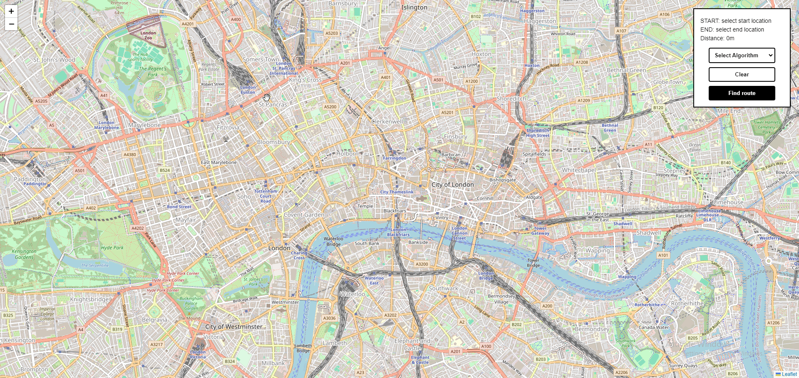

# City path finder




**An interactive web application designed to showcase graph algorithms through the lens of London's map.**

## Features

- **Interactive Map of London**: Navigate through a detailed map of London, visualizing the connections between different locations.
- **Algorithm Visualization**: BFS, DFS, and Dijkstra's algorithm visualise possible routes across the city.
- **Customizable Parameters**: Adjust the starting point, destination, and algorithm settings.


## Technologies Used

- **Backend**: Django
- **Frontend**: React
- **Mapping**: leaflet-react, osmnx, networkx

### Prerequisites

Ensure you have the following installed:
- Python (3.8 or newer)
- Node.js and npm

### Installation

1. **Clone the repository**

   ```bash
   git clone https://github.com/bleuehour/city-path-finder.git
   cd city-path-finder
   ```

2. **Setup Django** 
     ```bash
    cd backend
    python -m venv venv
     .\env\Scripts\activate.bat
    pip install -r requirements.txt
    python manage.py runserver
    ```


3. **Setup React**
    ```bash 
    cd frontend
    npm install
    npm start
    ```

